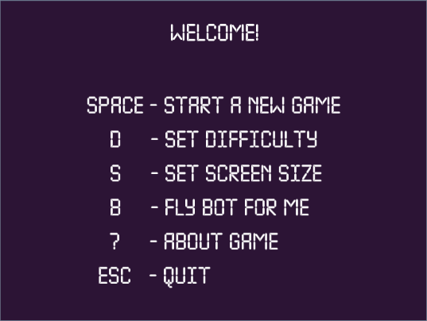
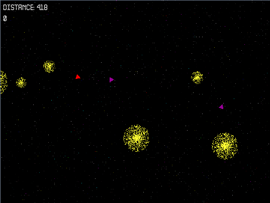

# OrbitalArcadeGame
2D space-flying arcade game prototype. C++ and SFML.

## Done

* gravitation
* dynamic stars generation
* NPC flyers (no interaction, part of landscape)
* bot flyers avoiding stars (calculations in threads)

## To be done

* settings
* results and leaderboard
* dynamic generation of infinite background
* nicer ships' and stars' sprites
* animation of collisions
